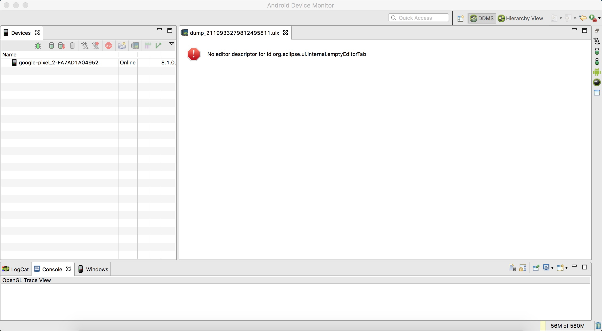

### 过程

- 配置了 Android SDK 到 $PATH 之后，就可以执行 `monitor` 命令，打开 DDMS 了
- 但是新版本的 Android Studio 基本上已经放弃了这个功能，而是进行了内置
- 今天执行 `monitor` 的时候报错，错误信息如下

```
java.lang.IllegalStateException: Unable to acquire application service. Ensure that the org.eclipse.core.runtime bundle is resolved and started (see config.ini).
    at org.eclipse.core.runtime.internal.adaptor.EclipseAppLauncher.start(EclipseAppLauncher.java:74)
    at org.eclipse.core.runtime.adaptor.EclipseStarter.run(EclipseStarter.java:353)
    at org.eclipse.core.runtime.adaptor.EclipseStarter.run(EclipseStarter.java:180)
    at java.base/jdk.internal.reflect.NativeMethodAccessorImpl.invoke0(Native Method)
    at java.base/jdk.internal.reflect.NativeMethodAccessorImpl.invoke(NativeMethodAccessorImpl.java:62)
    at java.base/jdk.internal.reflect.DelegatingMethodAccessorImpl.invoke(DelegatingMethodAccessorImpl.java:43)
    at java.base/java.lang.reflect.Method.invoke(Method.java:567)
    at org.eclipse.equinox.launcher.Main.invokeFramework(Main.java:629)
    at org.eclipse.equinox.launcher.Main.basicRun(Main.java:584)
    at org.eclipse.equinox.launcher.Main.run(Main.java:1438)
```

- 网上查找相关信息，可能是 Java 版本的问题
- 我电脑上安装了 JDK8 和 JDK12 但是都没有配置到环境变量
    + 所以使用的是这个 `/System/Library/Frameworks/JavaVM.framework/Versions/Current/Commands/java`
    + 而不是这个 `/Library/Java/JavaVirtualMachines/jdk1.8.0_202.jdk/Contents/Home//bin/java`
- 更新了 $PATH$ 之后，DDMS可以启动起来，但是提示另外一个异常，而且错误弹框也没法关闭
    + 找不到 uix 文件

```
java.io.FileNotFoundException: /var/folders/hx/ly6xh8qn41j04m8qb5g2x40c0000gn/T/uiautomatorviewer_399271821386812857/dump_2119933279812495811.uix (No such file or directory)
    at java.io.FileInputStream.open0(Native Method)
    at java.io.FileInputStream.open(FileInputStream.java:195)
    at java.io.FileInputStream.<init>(FileInputStream.java:138)
    at java.io.FileInputStream.<init>(FileInputStream.java:93)
    at sun.net.www.protocol.file.FileURLConnection.connect(FileURLConnection.java:90)
    at sun.net.www.protocol.file.FileURLConnection.getInputStream(FileURLConnection.java:188)
    at com.sun.org.apache.xerces.internal.impl.XMLEntityManager.setupCurrentEntity(XMLEntityManager.java:623)
    at com.sun.org.apache.xerces.internal.impl.XMLVersionDetector.determineDocVersion(XMLVersionDetector.java:148)
    at com.sun.org.apache.xerces.internal.parsers.XML11Configuration.parse(XML11Configuration.java:806)
    at com.sun.org.apache.xerces.internal.parsers.XML11Configuration.parse(XML11Configuration.java:771)
    at com.sun.org.apache.xerces.internal.parsers.XMLParser.parse(XMLParser.java:141)
    at com.sun.org.apache.xerces.internal.parsers.AbstractSAXParser.parse(AbstractSAXParser.java:1213)
    at com.sun.org.apache.xerces.internal.jaxp.SAXParserImpl$JAXPSAXParser.parse(SAXParserImpl.java:643)
    at com.sun.org.apache.xerces.internal.jaxp.SAXParserImpl.parse(SAXParserImpl.java:327)
    at javax.xml.parsers.SAXParser.parse(SAXParser.java:328)
    at com.android.uiautomator.tree.UiHierarchyXmlLoader.parseXml(UiHierarchyXmlLoader.java:130)
    at com.android.uiautomator.UiAutomatorModel.<init>(UiAutomatorModel.java:51)
    at com.android.ide.eclipse.ddms.editors.UiAutomatorViewer.createPartControl(UiAutomatorViewer.java:105)
    ...
```

- 每次打开报错信息都一样，那么表示有一个位置存储了这个最后一次打开的信息
    + 但是我在整个 `monitor-x86_64` 目录下并没有找到相关的配置信息，也包括 `configuration` 目录
    + 尝试重名了 `configuration` 目录，再启动 monitor 也还是一样
        * 表示配置文件不在这，但是在哪我又一时没找到
    + 去用户目录下大体喵了一下，没有 monitor 相关的配置

> 这个时候思路就开始跑偏了

- 开始去看 UiAutomatorModel 的源码
    + 甚至考虑用 javassist 进行代码注入，拦截参数查看相关信息

- `monitor` 是一个可执行文件，并不是一个脚本文件，但是最终它肯定会启动 Java
    + 我想能不能把启动参数获取下来，这样就可以自己用 java 命令行去启动 DDMS 了
        * 类似于 `java -jar xxx`
- 实际上我通过如下命令去启动 DDMS 的时候又会报另外一个异常，这一点我也不是很理解

```
java -jar plugins/org.eclipse.equinox.launcher_1.3.0.v20120522-1813.jar --launcher.library plugins/org.eclipse.equinox.launcher.cocoa.macosx.x86_64_1.1.200.v20120913-144807 -data @noDefault -vmargs -XX:MaxPermSize=256m -Xms512m -Xmx1024m -XstartOnFirstThread -Dorg.eclipse.swt.internal.carbon.smallFonts

java -jar plugins/org.eclipse.equinox.launcher_1.3.0.v20120522-1813.jar --launcher.library plugins/org.eclipse.equinox.launcher.cocoa.macosx.x86_64_1.1.200.v20120913-144807 -data @noDefault -vmargs -XX:MaxPermSize=256m -Xms512m -Xmx1024m -XstartOnFirstThread -Dorg.eclipse.swt.internal.carbon.smallFonts  -os macosx -ws cocoa -arch x86_64 -data @noDefault -keyring /Users/awang/.eclipse_keyring -showlocation
```

- 上面的启动参数有两部分，一部分是从启动失败的日志里面拿到的，还有一部分是从 monitor.ini 里面拿到的
    + `sdk/tools/lib/monitor-x86_64/configuration/1606484605965.log`
        * 失败日志
    + `sdk/tools/lib/monitor-x86_64/monitor.app/Contents/MacOS/monitor.ini`
        * 配置文件

- 失败日志头部信息如下

```
!SESSION 2020-11-27 21:43:25.667 -----------------------------------------------
eclipse.buildId=unknown
java.version=12.0.1
java.vendor=Oracle Corporation
BootLoader constants: OS=macosx, ARCH=x86_64, WS=cocoa, NL=zh_CN_#Hans
Framework arguments:  -keyring /Users/awang/.eclipse_keyring -showlocation
Command-line arguments:  -os macosx -ws cocoa -arch x86_64 -data @noDefault -keyring /Users/awang/.eclipse_keyring -showlocation
```

- 配置文件信息如下

```
-startup
../../../plugins/org.eclipse.equinox.launcher_1.3.0.v20120522-1813.jar
--launcher.library
../../../plugins/org.eclipse.equinox.launcher.cocoa.macosx.x86_64_1.1.200.v20120913-144807
-data
@noDefault
-vmargs
-XX:MaxPermSize=256m
-Xms512m
-Xmx1024m
-XstartOnFirstThread
-Dorg.eclipse.swt.internal.carbon.smallFonts
```

- 但可能最终上面的启动命令拼错了，所以就会报如下的错误

```
org.eclipse.swt.SWTException: Invalid thread access
    at org.eclipse.swt.SWT.error(SWT.java:4361)
    at org.eclipse.swt.SWT.error(SWT.java:4276)
    at org.eclipse.swt.SWT.error(SWT.java:4247)
    at org.eclipse.swt.widgets.Display.error(Display.java:1070)
    at org.eclipse.swt.widgets.Display.createDisplay(Display.java:827)
    at org.eclipse.swt.widgets.Display.create(Display.java:810)
    at org.eclipse.swt.graphics.Device.<init>(Device.java:130)
    at org.eclipse.swt.widgets.Display.<init>(Display.java:701)
    at org.eclipse.swt.widgets.Display.<init>(Display.java:692)
    at org.eclipse.ui.internal.Workbench.createDisplay(Workbench.java:669)
    at org.eclipse.ui.PlatformUI.createDisplay(PlatformUI.java:161)
    at com.android.ide.eclipse.monitor.MonitorApplication.start(MonitorApplication.java:45)
    at org.eclipse.equinox.internal.app.EclipseAppHandle.run(EclipseAppHandle.java:196)
    at org.eclipse.core.runtime.internal.adaptor.EclipseAppLauncher.runApplication(EclipseAppLauncher.java:110)
    at org.eclipse.core.runtime.internal.adaptor.EclipseAppLauncher.start(EclipseAppLauncher.java:79)
    at org.eclipse.core.runtime.adaptor.EclipseStarter.run(EclipseStarter.java:353)
    at org.eclipse.core.runtime.adaptor.EclipseStarter.run(EclipseStarter.java:180)
    at sun.reflect.NativeMethodAccessorImpl.invoke0(Native Method)
    at sun.reflect.NativeMethodAccessorImpl.invoke(NativeMethodAccessorImpl.java:62)
    at sun.reflect.DelegatingMethodAccessorImpl.invoke(DelegatingMethodAccessorImpl.java:43)
    at java.lang.reflect.Method.invoke(Method.java:498)
    at org.eclipse.equinox.launcher.Main.invokeFramework(Main.java:629)
    at org.eclipse.equinox.launcher.Main.basicRun(Main.java:584)
    at org.eclipse.equinox.launcher.Main.run(Main.java:1438)
    at org.eclipse.equinox.launcher.Main.main(Main.java:1414)
```

- 那我想着要不换一个思路，替换掉 java 这个可执行文件，然后在里面输出参数，这样不就能得到启动参数了

```
echo $*
java.origin $*
```

- 别的基本都OK，就 monitor 不行，奇了怪了

```
/sdk/tools/monitor: line 41: /sdk/tools/lib/monitor--classpath: No such file or directory
/sdk/tools/monitor: line 41: exec: /sdk/tools/lib/monitor--classpath: cannot execute: No such file or directory
```

- 这个时候就想，是不是因为我这个是 Shell 脚本，所以不能在 monitor 里面被调用，那行，我换一个方式
- 于是用 go 写了下面这段代码
    + 参考了这篇文章: [如何让命令行程序支持管道和重定向输入](https://mozillazg.com/2016/03/go-let-cli-support-pipe-read-data-from-stdin.html)

```
package main

import (
    "fmt"
    "io/ioutil"
    "os"
    "strings"

    "golang.org/x/crypto/ssh/terminal"
)

func main() {
    var data = os.Args
    if !terminal.IsTerminal(0) {
        b, err := ioutil.ReadAll(os.Stdin)
        if err == nil {
            data = append(data, string(b))
        }
    }
    if len(data) != 0 {
        fmt.Println(strings.Join(data, ", "))
    } else {
        fmt.Println("No Parameter")
    }
}
```

- `go buid java2.go` 之后得到可执行文件，然后再替换 java 文件
    + `java2: Mach-O 64-bit executable x86_64`
- 但是还是报一样的错误，这下我就不明白了，No such file，感觉是某个位置路径错了，但我说不出原因

```
/sdk/tools/monitor: line 41: /sdk/tools/lib/monitor-/Library/Java/JavaVirtualMachines/jdk1.8.0_202.jdk/Contents/Home//bin/java,: No such file or directory
/sdk/tools/monitor: line 41: exec: /sdk/tools/lib/monitor-/Library/Java/JavaVirtualMachines/jdk1.8.0_202.jdk/Contents/Home//bin/java,: cannot execute: No such file or directory
```

- 线索到这里就断了
- 也有尝试反编译 `monitor`，代码流程上还算清晰，但是又一些细节上不太理解，所以这个时候再想是不是可以找找看它的源码
- 通过关键字 `UiAutomatorModel` 搜索到一些相关信息
    + `https://android.googlesource.com/platform/sdk/+/tools_r20/eclipse/plugins/com.android.ide.eclipse.ddms/plugin.properties`
    + `https://android.googlesource.com/platform/sdk/+/refs/heads/android10-c2f2-release/eclipse/monitor/`
- `android10-c2f2-release/eclipse/monitor` 其实是 `sdk/tools/monitor` 而不是 `sdk/tools/lib/monitor-x86_64/monitor`
    + 其实做的事情就是 `exec /sdk/tools/lib/monitor-x86_64/monitor.app/Contents/MacOS/monitor`
- 另外如果执行 `exec /sdk/tools/lib/monitor-x86_64/monitor`，会提示如下错误
    + ~~大概还是需要通过 `monitor.app` 启动才行~~
        * 想了想也不一样 `monitor-x86_64/monitor` 和 `monitor-x86_64/monitor.app/Contents/MacOS/monitor` 明明是同一个文件
    + 如果我把 `monitor.app` 里面的 `monitor.ini` 拿出来直接放到 `monitor-x86_64/monitor` 同级目录，运行的话会直接 `segmentation fault` 异常
        * 改了一下 `monitor.ini` 里面 jar 的路径就好 (因为是相对路径)

```
[Alert]
The Monitor executable launcher was unable to locate its companion shared library
```

- `android10-c2f2-release/eclipse/monitor/build.gradle` 可以得知 `monitor.app` 是通过编译得来的
- 但是最终也没有找到 `monitor.app` 的源码

- 无奈之余，只好暂时放弃，回来继续找配置文件
- 最后发现了 `~/.android/monitor-workspace` 不太一样
    + 通过 `find ~/.android/monitor-workspace | xargs grep 'uix'` 找到配置文件位置
    + `monitor-workspace/.metadata/.plugins/org.eclipse.e4.workbench/workbench.xmi`
- 删掉对应的 xml 节点之后，DDMS 终于可以启动起来，但是整个页面是空白的？
    + 难道是我删错了？(这是我记录本次过程的时候才想到的)
- 我删掉了下面一整段

```
<sharedElements xsi:type="advanced:Area" xmi:id="_y3KP4LFYEeaatZWx-YPXqA" elementId="org.eclipse.ui.editorss" selectedElement="_y3KP4bFYEeaatZWx-YPXqA">
  <children xsi:type="basic:PartStack" xmi:id="_y3KP4bFYEeaatZWx-YPXqA" elementId="org.eclipse.e4.primaryDataStack" selectedElement="_gnH6kKVzEei1XeAlsQvsVA">
    <tags>newtablook</tags>
    <tags>org.eclipse.e4.primaryDataStack</tags>
    <tags>EditorStack</tags>
    <children xsi:type="basic:Part" xmi:id="_gnH6kKVzEei1XeAlsQvsVA" elementId="org.eclipse.e4.ui.compatibility.editor" contributionURI="bundleclass://org.eclipse.ui.workbench/org.eclipse.ui.internal.e4.compatibility.CompatibilityEditor" label="dump_2119933279812495811.uix" iconURI="platform:/plugin/com.android.ide.eclipse.ddms/icons/uiautomator.png" tooltip="/var/folders/hx/ly6xh8qn41j04m8qb5g2x40c0000gn/T/uiautomatorviewer_399271821386812857/dump_2119933279812495811.uix" closeable="true">
      <persistedState key="memento" value="&lt;?xml version=&quot;1.0&quot; encoding=&quot;UTF-8&quot;?>&#xA;&lt;editor id=&quot;com.android.ide.eclipse.ddms.editors.UiAutomatorViewer&quot;>&#xA;&lt;input factoryID=&quot;org.eclipse.ui.ide.FileStoreEditorInputFactory&quot; uri=&quot;file:/var/folders/hx/ly6xh8qn41j04m8qb5g2x40c0000gn/T/uiautomatorviewer_399271821386812857/dump_2119933279812495811.uix&quot;/>&#xA;&lt;/editor>"/>
      <tags>Editor</tags>
      <tags>com.android.ide.eclipse.ddms.editors.UiAutomatorViewer</tags>
      <tags>removeOnHide</tags>
      <tags>activeOnClose</tags>
    </children>
  </children>
</sharedElements>
```

- 实际上我只需要删掉下面这一部分即可

```
<persistedState key="memento" value="&lt;?xml version=&quot;1.0&quot; encoding=&quot;UTF-8&quot;?>&#xA;&lt;editor id=&quot;com.android.ide.eclipse.ddms.editors.UiAutomatorViewer&quot;>&#xA;&lt;input factoryID=&quot;org.eclipse.ui.ide.FileStoreEditorInputFactory&quot; uri=&quot;file:/var/folders/hx/ly6xh8qn41j04m8qb5g2x40c0000gn/T/uiautomatorviewer_399271821386812857/dump_2119933279812495811.uix&quot;/>&#xA;&lt;/editor>"/>
```

- 这样终于可以见到熟悉的界面了，这次折腾也算没白费
- 同时也让我理解了最开始的那个问题，为什么"找不到 uix 文件的错误弹框没法关闭"，因为DDMS完全没有获取到焦点
    + 猜测可能是没有兼容新版 Mac 系统导致的
    + macOS 10.13.6



### 未解决的问题

- `monitor.app` 的源码没找到
    + 关联问题，为什么替换 java 程序之后会报 `No such file or directory` 错误
    + 版本号 `25.2.2` 是不是就是 sdk 的版本
